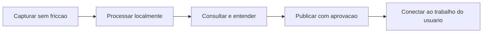
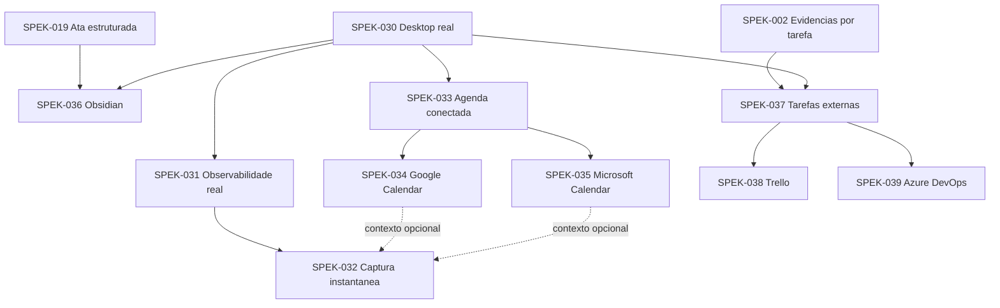

# Roadmap de produto

Este roadmap organiza o desenvolvimento depois da alpha. Ele indica ordem e dependencias, nao datas prometidas. Somente uma SPEK aprovada entra em implementacao.

## Norte do produto

## Sequencia executavel

| Horizonte | Resultado | SPEKs | Prioridade | Confianca da direcao |
| --- | --- | --- | --- | ---: |
| Concluido | Desktop real e console persistente operam com dados locais | 030, 031 | entregue | 100% |
| Agora | Validar captura assistida ou automatica em chamadas reais | 032 | P1 | 90% |
| Contexto de agenda | Eventos Google e Microsoft alimentam o detector local | 033, 034, 035 | P2 | 85% |
| Conhecimento | Atas sao publicadas em um vault Obsidian sem plugin | 036 | P2 | 95% |
| Execucao | Tarefas aprovadas sao enviadas ao Trello ou Azure DevOps | 037, 038, 039 | P3 | 80% |

Confianca indica estabilidade da direcao tecnica em 2026-08-05, nao probabilidade de prazo.

## Mapa de dependencias

O detector da SPEK-032 funciona primeiro com sinais locais. Agendas conectadas acrescentam contexto e reduzem falsos positivos sem se tornarem obrigatorias.

## Politicas para toda integracao

- A gravacao, transcricao e retencao continuam funcionando sem internet e sem contas externas.
- Toda integracao e opcional, desconectavel e isolada do estado da reuniao.
- Calendarios sao somente leitura no primeiro corte.
- Tokens ficam protegidos pelo usuario Windows, nunca em texto puro no SQLite, configuracao ou logs.
- Metadados externos sensiveis possuem prazo de retencao, limpeza por conta e protecao proporcional ao risco.
- A LLM apenas propoe dados estruturados. Ela nao envia, atualiza, conclui ou exclui itens externos.
- Toda escrita externa exige revisao e confirmacao humana, possui idempotencia e deixa trilha local.
- Resultado remoto ambiguo nunca dispara nova escrita automatica.
- Falha externa nao impede arquivamento nem libera gravacao para retencao.
- Copias publicadas no Obsidian, Trello ou Azure DevOps ficam fora da retencao do Anamnesis e isso e informado antes do envio.
- Nenhum adaptador automatiza interfaces web.
- Nenhum adaptador exclui ou fecha conteudo remoto automaticamente.
- Dependencia, autenticacao ou integracao nova exige ADR aceito antes do codigo.

## Alternativas registradas

| Tema | Direcao principal | Alternativa futura | Probabilidade de adequacao |
| --- | --- | --- | ---: |
| Agenda | Polling incremental local com cursor por conta | Webhooks por relay HTTPS | 90% / 10% |
| Obsidian | Criar Markdown diretamente no vault | CLI oficial ou plugin | 85% / 15% |
| Tarefas | Publicacao unidirecional apos aprovacao | Sincronizacao bidirecional | 90% / 10% |
| Inicio de gravacao | Modo assistido por padrao | Automatico opt-in com dois sinais | 75% / 25% |
| Trello | REST Cards com token delegado | Adiar ate autenticacao moderna | 65% / 35% |
| Azure DevOps | Microsoft Entra ID e MSAL para Services | Adapter separado para Server local | 95% / 5% |

## Ideias futuras ainda sem SPEK

| Ideia | Valor | Complexidade | Confianca | Gatilho para promover |
| --- | --- | --- | ---: | --- |
| Busca local por texto em atas e transcricoes | Alto | Media | 90% | Historico real estabilizado |
| Diarizacao local por participante | Alto | Alta | 70% | Benchmark local de qualidade e desempenho |
| Marcadores e clipes de audio vinculados a evidencia | Alto | Media | 80% | Evidencias temporais completas na SPEK-002 |
| Busca semantica local e perguntas sobre o historico | Medio | Alta | 70% | Modelo local e politica de indice definidos |
| Templates de ata e exportacao PDF ou DOCX | Alto | Baixa | 90% | Demanda de formatos confirmada |
| Backup criptografado e restauracao | Alto | Alta | 75% | Modelo de ameacas e destino escolhidos |
| Consentimento visual e politicas por reuniao | Alto | Media | 90% | Captura automatica entrar em beta |
| Atualizacao automatica e assinatura de releases | Alto | Media | 85% | Canal beta estabilizado |
| Pacote de diagnostico com redacao automatica | Alto | Baixa | 95% | Observabilidade real concluida |
| Perfis e workspaces separados | Medio | Media | 75% | Uso pessoal e profissional na mesma maquina |
| GitHub Issues, Jira e Notion | Medio | Media | 70% | Contrato da SPEK-037 validado em dois providers |

Uma ideia recebe numero de SPEK somente quando houver objetivo pequeno, criterio de aceite verificavel e posicao clara na sequencia.

## Gates arquiteturais

| Antes de implementar | Decisao obrigatoria |
| --- | --- |
| SPEK-033 a 035 | ADR de OAuth desktop, cache protegido e politica de polling |
| SPEK-036 | ADR de publicacao local no vault e protecao contra sobrescrita |
| SPEK-037 a 039 | ADR de aprovacao, idempotencia e propriedade dos campos remotos |
| Qualquer webhook | ADR de infraestrutura publica, custos e privacidade |

## Referencias oficiais verificadas

- [Google Calendar: sincronizacao incremental](https://developers.google.com/workspace/calendar/api/guides/sync)
- [Microsoft Graph: delta de eventos](https://learn.microsoft.com/en-us/graph/delta-query-events)
- [Obsidian: armazenamento em arquivos locais](https://obsidian.md/help/data-storage)
- [Trello: Cards REST API](https://developer.atlassian.com/cloud/trello/rest/api-group-cards/)
- [Azure DevOps: autenticacao recomendada](https://learn.microsoft.com/en-us/azure/devops/integrate/get-started/authentication/authentication-guidance?view=azure-devops)

As APIs e politicas dos fornecedores podem mudar. Cada SPEK de provider deve revalidar suas referencias oficiais no inicio da implementacao.
