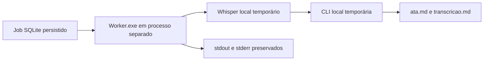

# SPEK-015 | Worker black box com evidências

## Objetivo

Executar o Worker compilado como processo separado e comprovar, por stdout, stderr, SQLite e arquivos, o consumo de um job real persistido.



## Regras

- O Worker lê uma configuração exclusiva indicada por variável de ambiente, sem alterar `%LocalAppData%` do usuário.
- O ensaio inicia um processo real do Worker e captura stdout, stderr e código de saída.
- SQLite, repositório, fila, transcritor, CLI, arquivador e Worker são reais; apenas binários indisponíveis são scripts locais temporários.
- O Worker emite mensagens curtas e determinísticas para início, job processado, fila vazia e falha.

## Critérios de aceite

- [x] Um teste de integração inicia o Worker compilado em processo separado e recebe código zero.
- [x] O log capturado confirma configuração isolada, job processado e fila vazia.
- [x] Banco SQLite e arquivos arquivados confirmam `Arquivada` após o processo encerrar.
- [x] Uma execução de evidência preserva `resultado.md`, `worker.stdout.log`, `worker.stderr.log`, `config.json`, SQLite, ata, transcrição e o JSON recebido pela CLI.

## Decisões pendentes

- OBS e o Tray real continuam para a validação manual da SPEK-011.

## Execução

```powershell
powershell -NoProfile -ExecutionPolicy Bypass -File .\scripts\Executar-WorkerBlackBoxE2E.ps1
```
