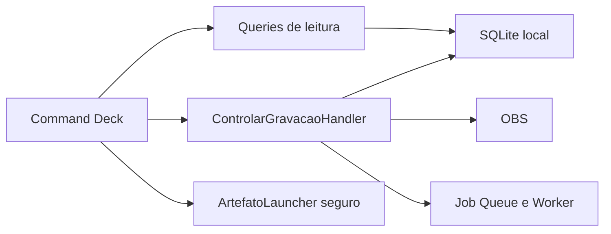

# SPEK-030 Desktop com dados reais

## Objetivo

Substituir o estado simulado da POC por consultas e comandos reais, permitindo iniciar e finalizar uma gravacao, acompanhar o processamento, consultar o historico e abrir artefatos arquivados pela interface Windows.

## Fora de escopo

- Redesenhar o Design System Desktop.
- Persistir o console de observabilidade, tratado na SPEK-031.
- Detectar reunioes automaticamente, tratado na SPEK-032.
- Conectar calendarios, Obsidian ou gestores de tarefas.
- Editar ou excluir reunioes e artefatos.
- Alterar estados de dominio diretamente pela interface.

## Regras

- A interface chama casos de uso de Application e nunca acessa SQL, OBS ou processos diretamente.
- Consultas de leitura usam modelos proprios por fronteiras `ReuniaoQuery` e `JobQuery`; agregados mutaveis nao sao expostos ao Tray.
- Iniciar e finalizar usam `ControlarGravacaoHandler` e preservam todas as transicoes existentes.
- O SQLite possui indice unico parcial para permitir no maximo uma reuniao em estado `Gravando`; o conflito e traduzido para erro de aplicacao seguro.
- A reserva do estado `Gravando` ocorre antes de chamar o OBS. Em duas inicializacoes concorrentes, somente a vencedora chega ao gravador.
- Cancelamento durante o inicio compensa a reserva para `Falha`. A reconciliacao automatica por `GetRecordStatus` descrita na entrega original foi supersedida pela SPEK-032: apos reinicio, uma reuniao `Gravando` aparece como recuperacao pendente e nenhum comando ou consulta com efeito colateral no OBS ocorre sem acao explicita.
- Ao criar o indice em banco legado, somente a reuniao `Gravando` mais recente permanece ativa; duplicatas antigas viram `Falha` com motivo deterministico.
- A tela lista as 100 reunioes mais recentes e permite filtrar por texto e status sem carregar arquivos de audio.
- O detalhe mostra titulo, identificador, tempos, status, falha, job e caminhos de ata, transcricao e gravacao quando existirem.
- `JobQuery` retorna o job mais recente por `criado_em DESC, id DESC`, com identificador, estado derivado, tentativas, reserva e conclusao.
- O estado do job e `Concluido` quando `concluido_em` existe, `EmProcessamento` quando apenas `reservado_em` existe e `Pendente` nos demais casos.
- O Worker persiste um manifesto local de artefatos depois do arquivamento, com diretorio, ata e transcricao. O Desktop nao recalcula caminhos usando a configuracao atual.
- A interface atualiza depois de cada comando e por polling local leve enquanto a janela estiver visivel.
- Abrir arquivo ou pasta exige caminho persistido, normalizado e existente. Entrada arbitraria do usuario nao e executada.
- Falhas aparecem como estado acionavel e nao encerram o Tray.
- Operacoes demoradas sao assincronas e nao bloqueiam a thread da interface.
- O modo demonstracao continua disponivel por argumento explicito; o modo normal nao injeta dados simulados.

## Fluxo

## Critérios de aceite

- [x] A abertura normal do Desktop exibe o historico persistido no SQLite, sem reunioes simuladas.
- [x] Busca e filtro retornam reunioes em ordem decrescente de criacao.
- [x] O detalhe representa corretamente todos os estados atuais do dominio e o job associado.
- [x] O botao iniciar cria e persiste uma reuniao real e inicia o OBS pelo caso de uso existente.
- [x] O botao finalizar salva o caminho de audio, enfileira o job e inicia o Worker.
- [x] Uma segunda tentativa de inicio e recusada de forma deterministica.
- [x] Duas inicializacoes concorrentes deixam exatamente uma reuniao `Gravando` e fazem uma unica chamada ao OBS.
- [x] Cancelamento e banco legado nao deixam uma reserva `Gravando` acidental; reinicio preserva a gravacao anterior como recuperacao pendente conforme a SPEK-032.
- [x] A interface acompanha as mudancas do Worker sem reiniciar a janela.
- [x] Ata, transcricao e pasta arquivada podem ser abertas quando existem.
- [x] Mudar o diretorio configurado depois do arquivamento nao invalida caminhos historicos ja persistidos.
- [x] Caminho ausente ou invalido produz mensagem segura e evento local, sem executar processo arbitrario.
- [x] O modo demonstracao continua funcionando sem OBS, banco permanente, rede ou CLI real.
- [x] Testes automatizados cobrem queries, comandos, composicao e abertura segura.
- [x] A publicacao `win-x64` executa o fluxo real sem regressao visual.

## Testes associados

- Testes de Application para `ReuniaoQuery`, `JobQuery` e bloqueio de gravacao concorrente.
- Testes de Infrastructure com SQLite temporario para lista, filtro, ordenacao e relacionamento de job.
- Teste de concorrencia no SQLite prova uma unica transicao para `Gravando` e uma unica chamada fake ao gravador.
- Testes do manifesto de artefatos cobrem persistencia, reinicio e mudanca posterior da raiz configurada.
- Testes do Tray com fakes para atualizacao assincrona, comandos e estados de erro.
- Testes de `ArtefatoLauncher` sem abrir processo real.
- `dotnet test Anamnesis.sln --configuration Release --no-restore --verbosity minimal`

## Sequencia TDD

1. Red: queries de historico e job falham por ausencia dos contratos.
2. Green: implementar leitura minima no SQLite e semantica do job mais recente.
3. Red: comandos reais e protecao contra dupla gravacao falham.
4. Green: adicionar a trava atomica e compor os casos de uso existentes no Desktop.
5. Red: abertura segura e atualizacao de tela falham.
6. Green: persistir o manifesto, implementar launcher e polling local minimo.
7. Refactor: remover acoplamento ao `DesktopPocState` do modo real.

## Decisoes

- Nenhuma dependencia nova e necessaria, portanto esta SPEK nao exige ADR adicional.
- Polling local e preferido a um barramento de eventos neste incremento para manter o corte pequeno.
- O estado demonstrativo permanece separado do estado real.
- Caminhos arquivados sao persistidos em tabela separada do agregado para preservar o dominio e sobreviver a mudanca de configuracao.

## Decisoes pendentes

- Nenhuma para este incremento. O read model foi separado em resumo, detalhe e job; o manifesto persiste diretorio, ata e transcricao.
- O polling foi fixado em dois segundos, executado somente com a janela visivel e protegido contra sobreposicao.

## Entrega

- Red 1: testes falharam pela ausencia de `ReuniaoQuery`, `JobQuery` e seus modelos de leitura.
- Red 2: testes falharam pela ausencia da traducao de conflito para gravacao unica antes do OBS.
- Red 3: testes falharam pela ausencia do manifesto, retorno do arquivador e `WindowsArtefatoLauncher`.
- Red 4: testes falharam pela ausencia de `IDesktopSession` e da sessao real.
- Red 5: testes de regressao expuseram polling de detalhe desatualizado, reserva orfa apos cancelamento ou reinicio, duplicatas `Gravando` em banco legado e encerramento concorrente.
- Red 6: testes de regressao expuseram ausencia do token de vida da janela no inicio e do bloqueio amigavel para clique duplo.
- Green: 121 testes em `Release`, sendo 3 de Domain, 14 de Application e 104 de Infrastructure.
- Publicacao: Tray e Worker `win-x64` foram publicados em `artifacts/publish/SPEK-030` sem nova dependencia.
- Smoke: o executavel publicado manteve a janela principal `Anamnesis` ativa e criou o SQLite da configuracao isolada.
- Evidencia visual: `artifacts/evidencias/SPEK-030/desktop-real-vazio.png` mostra o modo real escuro sem reunioes ou telemetria simuladas.
- E2E publicado: `artifacts/evidencias/SPEK-030/fluxo-publicado-121/resultado.md` comprova Tray publicado, job SQLite, Worker publicado, ata, transcricao, manifesto persistido e estado `Arquivada` com adaptadores locais controlados.
- Revisao independente: nenhum P0, P1 ou P2 permaneceu apos as regressoes de concorrencia, recuperacao, polling e ciclo de vida da janela.
