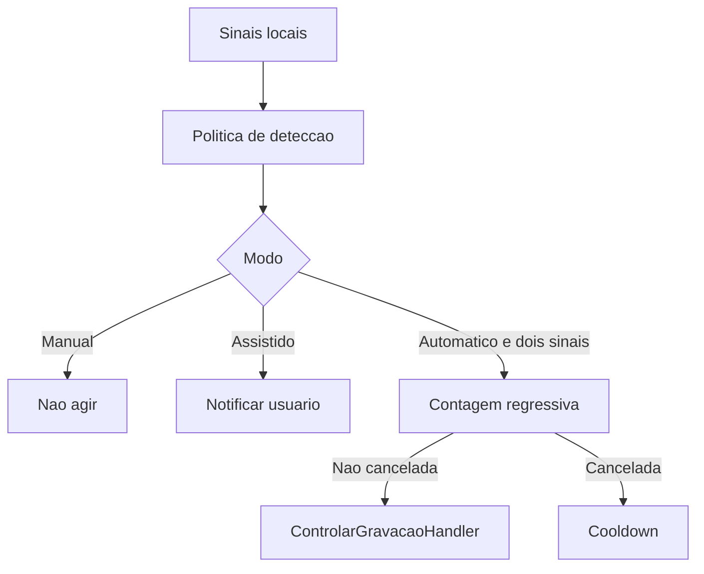

# SPEK-032 Captura instantanea e deteccao local

## Objetivo

Reduzir o inicio da gravacao a segundos quando o usuario entra em uma chamada no Teams, Meet, Zoom, Discord ou outra plataforma que reproduza audio pelo Windows, sem integrar ou automatizar a interface dessas plataformas.

## Fora de escopo

- Garantir identificacao perfeita de toda plataforma ou aba de navegador.
- Ler DOM, extensoes, cookies, mensagens ou conteudo da chamada.
- Gravar escondido ou ignorar a escolha do usuario.
- Capturar audio sem OBS ou alterar a politica de retencao.
- Usar agenda como dependencia obrigatoria.

## Modos

| Modo | Comportamento | Padrao |
| --- | --- | --- |
| Manual | Apenas comandos explicitos iniciam e encerram | Disponivel sempre |
| Assistido | Um sinal forte exibe notificacao com iniciar, ignorar e silenciar | Sim |
| Automatico | Microfone mais sinal local de plataforma iniciam apos contagem regressiva cancelavel | Nao, exige opt-in |

## Regras

- Sinais locais permitidos: sessao de audio ativa, uso de microfone, processo ou janela em allowlist e evento de agenda proximo.
- Titulo de janela pode ser avaliado em memoria, mas nunca persistido ou registrado em log.
- Modo automatico exige microfone ativo mais um sinal local de plataforma sustentados por pelo menos cinco segundos.
- Para aplicativo nativo, o segundo sinal e processo ou janela em allowlist. Para navegador, e uma assinatura de janela de chamada conhecida, nunca apenas o processo generico do navegador.
- Evento de agenda e audio generico apenas aumentam a confianca do modo assistido. Eles nao substituem o microfone nem satisfazem o segundo sinal do modo automatico.
- O usuario recebe contagem regressiva visivel de cinco segundos e pode cancelar antes de iniciar.
- Ignorar cria cooldown configuravel para o mesmo processo ou evento, sem bloquear inicio manual.
- Apenas uma reuniao pode permanecer em estado `Gravando`.
- Finalizacao manual e sempre soberana. Finalizacao automatica exige opt-in separado e ausencia de sinais por dois minutos, com aviso cancelavel.
- Ao reiniciar, o Tray reconcilia reuniao `Gravando` com o estado real do OBS, mas nunca inicia, retoma ou encerra gravacao automaticamente. O usuario escolhe a acao de recuperacao.
- A captura continua universal pelo audio do sistema e microfone gerenciados na SPEK-024.
- Toda decisao do detector gera evento seguro da SPEK-031 sem titulo de janela ou conteudo de agenda.
- Falha de um sinal reduz a confianca, mas nunca impede o modo manual.
- Toda gravacao ativa possui indicador persistente no Desktop e no Tray, alem de notificacao no inicio automatico.

## Fluxo de decisao

## Critérios de aceite

- [ ] Meet no navegador pode gerar sugestao quando audio, microfone e janela conhecida estiverem presentes.
- [ ] Teams, Zoom e outro processo configurado usam a mesma politica, sem adapter especifico de gravacao.
- [ ] O modo assistido nunca inicia sem clique do usuario.
- [ ] O modo automatico nunca inicia sem microfone ativo, sinal local de plataforma e opt-in.
- [ ] Evento de agenda mais audio generico nao inicia gravacao automaticamente.
- [ ] YouTube, musica, ditado, evento sem chamada e duas aplicacoes simultaneas nao produzem inicio automatico com sinais insuficientes.
- [ ] Contagem regressiva, cancelamento, cooldown e inicio manual sao deterministas.
- [ ] Nenhum titulo de janela ou dado de agenda aparece no journal.
- [ ] Uma gravacao ativa bloqueia qualquer segunda inicializacao.
- [ ] Reinicio durante gravacao nao cria, retoma ou para o OBS sem confirmacao.
- [ ] O indicador de gravacao permanece visivel durante todo o estado `Gravando`.
- [ ] Testes usam fontes de sinais fake e relogio controlado, sem abrir navegador, OBS ou plataforma real.
- [ ] Um ensaio manual Windows registra tempos e evidencias para Meet no navegador e Teams ou Zoom.

## Decisoes pendentes

- Criar ADR para as APIs Windows de Core Audio, microfone e enumeracao de janelas antes do codigo.
- Validar em POC quais sinais distinguem chamada de musica, video e gravacao de voz com menos falsos positivos.
- Definir allowlist inicial e configuracao por navegador sem coletar historico de navegacao.
