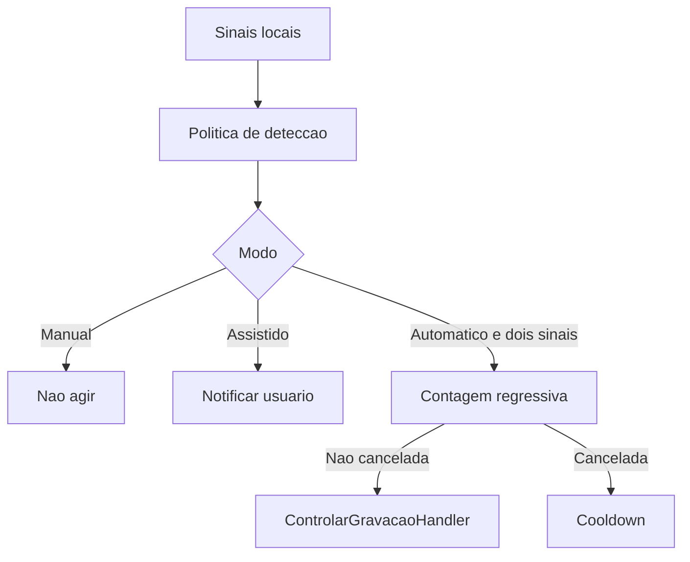

# SPEK-032 Captura instantanea e deteccao local

## Objetivo

Reduzir o inicio da gravacao a segundos quando o usuario entra em uma chamada no Teams, Meet, Zoom, Discord ou outra plataforma que reproduza audio pelo Windows, sem integrar ou automatizar a interface dessas plataformas.

## Fora de escopo

- Garantir identificacao perfeita de toda plataforma ou aba de navegador.
- Ler DOM, extensoes, cookies, mensagens ou conteudo da chamada.
- Gravar escondido ou ignorar a escolha do usuario.
- Capturar audio sem OBS ou alterar a politica de retencao.
- Usar agenda como dependencia obrigatoria.

## Modos

| Modo | Comportamento | Padrao |
| --- | --- | --- |
| Manual | Apenas comandos explicitos iniciam e encerram | Disponivel sempre |
| Assistido | Um sinal forte exibe notificacao com iniciar, ignorar e silenciar | Sim |
| Automatico | Microfone mais sinal local de plataforma iniciam apos contagem regressiva cancelavel | Nao, exige opt-in |

## Regras

- Sinais locais permitidos: sessao de audio ativa, uso de microfone, processo ou janela em allowlist e evento de agenda proximo.
- A coleta segue o ADR-016: polling de um segundo em thread MTA, Core Audio para sessoes ativas e User32 para janelas superiores.
- Titulo de janela pode ser avaliado em memoria, mas nunca persistido ou registrado em log.
- Modo automatico exige microfone ativo mais um sinal local de plataforma sustentados por pelo menos cinco segundos.
- Para aplicativo nativo, o segundo sinal e uma sessao de captura cuja familia esteja na allowlist. Apenas encontrar o processo aberto nao basta.
- Para navegador, a mesma familia deve possuir sessao de captura e uma janela com assinatura de chamada conhecida. O processo generico do navegador nunca basta.
- Sessoes de renderizacao aumentam a confianca assistida, mas nunca autorizam inicio automatico.
- Duas plataformas com captura simultanea formam um sinal ambiguo e nao autorizam inicio automatico.
- Evento de agenda e audio generico apenas aumentam a confianca do modo assistido. Eles nao substituem o microfone nem satisfazem o segundo sinal do modo automatico.
- O usuario recebe contagem regressiva visivel de cinco segundos e pode cancelar antes de iniciar.
- Ignorar cria cooldown configuravel, de dez minutos por padrao, para a mesma plataforma ou evento. Silenciar pausa por uma hora sugestoes, contagens e encerramento automatico, reiniciando depois o relogio de ausencia. Nenhuma das duas acoes bloqueia inicio manual.
- Apenas uma reuniao pode permanecer em estado `Gravando`.
- Finalizacao manual e sempre soberana. Finalizacao automatica exige opt-in separado, vale somente para o `ReuniaoId` iniciado automaticamente no processo atual e requer ausencia de sinais por dois minutos, com aviso cancelavel de quinze segundos.
- Se o encerramento automatico falhar, novas tentativas ficam suprimidas ate os sinais retornarem ou o usuario decidir explicitamente; o Tray nunca repete `StopRecord` invisivelmente a cada polling.
- Ao reiniciar com uma reuniao `Gravando`, o detector fica suspenso e o Desktop apresenta recuperacao pendente. Nenhum preflight, inicio, retomada, encerramento ou mudanca de estado do OBS ocorre sem acao explicita do usuario.
- A captura continua universal pelo audio do sistema e microfone gerenciados na SPEK-024.
- Toda decisao do detector gera evento seguro da SPEK-031 sem titulo de janela ou conteudo de agenda.
- Falha de um sinal reduz a confianca, mas nunca impede o modo manual.
- Qualquer probe indisponivel marca a coleta como nao confiavel, cancela contagens ou avisos abertos e pausa inicio e encerramento automaticos. Falha de coleta nunca equivale a ausencia de chamada.
- O journal registra somente as transicoes sanitizadas `degradada` e `restaurada`, sem repetir o mesmo estado a cada polling.
- Toda gravacao ativa possui indicador persistente no Desktop e no Tray, alem de notificacao no inicio automatico.
- A allowlist inicial segue o ADR-016 e pode ser estendida em `config.json` sem armazenar titulos observados.
- O titulo persistido para uma captura detectada usa apenas o nome normalizado da plataforma, nunca o titulo da janela.

## Fluxo de decisao



## Critérios de aceite

- [x] Meet no navegador pode gerar sugestao quando audio, microfone e janela conhecida estiverem presentes.
- [x] Teams, Zoom e outro processo configurado usam a mesma politica, sem adapter especifico de gravacao.
- [x] O modo assistido nunca inicia sem clique do usuario.
- [x] O modo automatico nunca inicia sem microfone ativo, sinal local de plataforma e opt-in.
- [x] Evento de agenda mais audio generico nao inicia gravacao automaticamente.
- [x] YouTube, musica, ditado, evento sem chamada e duas aplicacoes simultaneas nao produzem inicio automatico com sinais insuficientes.
- [x] Contagem regressiva, cancelamento, cooldown e inicio manual sao deterministas.
- [x] Nenhum titulo de janela ou dado de agenda aparece no journal.
- [x] Uma gravacao ativa bloqueia qualquer segunda inicializacao.
- [x] Reinicio durante gravacao nao cria, retoma ou para o OBS sem confirmacao.
- [x] O indicador de gravacao permanece visivel durante todo o estado `Gravando`.
- [x] Testes usam fontes de sinais fake e relogio controlado, sem abrir navegador, OBS ou plataforma real.
- [x] Um ensaio manual Windows registra tempos e evidencias para Meet no navegador e Teams ou Zoom. (roteiro criado em `Ensaio Manual SPEK-032.md`; aguardando execucao por usuario)

## Decisoes pendentes

- Nenhuma decisao arquitetural bloqueante. APIs, privacidade, polling e allowlist inicial foram aprovados no ADR-016.
- O ensaio manual permanece criterio de aceite e deve medir falsos positivos contra musica, video, ditado, mute e duas plataformas simultaneas antes de concluir a SPEK.

## Como validar

O modo diagnostico do executavel publicado grava JSONL seguro em um arquivo novo. O caminho informado em `--saida` nao pode existir antes da execucao.

```powershell
$env:ANAMNESIS_CONFIGURACAO = 'C:\caminho\config.json'
Start-Process `
  -FilePath '.\Anamnesis.Tray.exe' `
  -ArgumentList '--diagnostico-deteccao','--amostras','5','--intervalo-ms','200','--saida','C:\caminho\diagnostico.jsonl' `
  -Wait
Get-Content 'C:\caminho\diagnostico.jsonl'
```

Cada amostra contem somente modo, horario, booleanos, codigo e nome normalizados da plataforma e `coletaConfiavel`. Nao contem titulo bruto, PID, processo desconhecido ou dispositivo.

## Entrega parcial

- Red: 18 testes da politica falharam antes dos contratos de decisao, cooldown, auto-stop e posse por reuniao.
- Red de regressao: a suite canonicamente falhou porque o 13o codigo operacional ainda nao estava no catalogo nem no E2E da alpha.
- Red de publicacao: o `WinExe` nao expunha o JSONL no terminal; `--saida` e um runner testavel passaram a produzir arquivo verificavel sem sobrescrita.
- Red de revisao: coleta degradada ou parcialmente COM podia contar como ausencia; o X nao cancelava automacao; prompts podiam permanecer congelados; o detector iniciava antes do primeiro snapshot SQLite; a posse do auto-stop nao estava ligada ao `ReuniaoId`; e falha no `StopRecord` podia repetir o comando sem novo aviso.
- Green: 231 testes em Release, sendo 3 de Domain, 51 de Application e 177 de Infrastructure.
- E2E controlado: fonte fake, politica, prompt, clique, SQLite real, gravador fake e journal seguro persistem uma reuniao `Gravando`.
- POC local: Core Audio e User32 reais produziram amostras sanitizadas sem titulo, PID ou dispositivo.
- Evidencias visuais: `artifacts/evidencias/SPEK-032/desktop-real.png` e `recovery-real.png` mostram recuperacao pendente e confirmam que nenhum comando automatico foi enviado ao OBS.
- Publicacao: Tray `win-x64` em `artifacts/publish/SPEK-032-v3`.
- Revisao independente: aprovada sem achados P0, P1, P2 ou P3 depois dos testes de regressao; hashes e smoke da publicacao v3 conferidos.
- Pendente: somente o ensaio manual com uma chamada Meet e outra Teams ou Zoom, incluindo falsos positivos.
