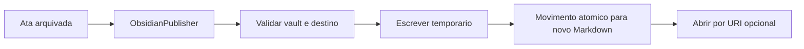

# SPEK-036 Publicacao local no Obsidian

## Objetivo

Permitir que o usuario publique atas concluidas em um vault Obsidian como arquivos Markdown comuns, preservando privacidade, idempotencia e edicoes manuais.

## Fora de escopo

- Instalar ou exigir plugin do Obsidian.
- Exigir Obsidian aberto durante a publicacao.
- Sincronizar alteracoes do vault de volta ao Anamnesis.
- Atualizar, anexar ou sobrescrever nota ja publicada.
- Copiar audio para o vault.
- Usar rede, Obsidian Sync ou CLI no primeiro corte.
- Abrir automaticamente o Obsidian depois da publicacao.

## Regras

- A integracao e opt-in e o usuario escolhe o vault; o primeiro corte usa a subpasta segura `Anamnesis/Reunioes/AAAA/MM`.
- O caminho selecionado precisa conter `.obsidian`, ser resolvido de forma canonica e permanecer dentro do vault.
- Nenhum arquivo pode ser criado dentro de `.obsidian`.
- Somente reuniao com ata estruturada persistida pode ser publicada; a nota e reconstruida do read model local sem copiar audio ou transcricao integral.
- Uma reuniao produz no maximo uma nota por vault usando `ReuniaoId` como chave idempotente.
- A nota e criada em `Anamnesis/Reunioes/AAAA/MM/` ou subpasta configurada.
- O nome usa data, titulo sanitizado e identificador curto, sem depender apenas do titulo.
- A escrita ocorre em arquivo temporario no mesmo volume e termina por movimento atomico.
- Arquivo existente nunca e sobrescrito. Reexecucao retorna a nota ja correlacionada.
- Propriedades YAML incluem `anamnesis_id`, data, status, origem e tags estaveis.
- Tarefas usam checkbox Markdown, sem transformar o Obsidian em fonte de verdade.
- O caminho final e informado depois da criacao; abrir automaticamente fica fora do primeiro corte para nao adicionar nova superficie de shell.
- Falha de publicacao nao muda o estado da reuniao e nao interfere na retencao.
- A tela avisa quando o vault estiver em OneDrive, Dropbox ou outro caminho possivelmente sincronizado.
- Vault possivelmente sincronizado exige confirmacao explicita e informa que a copia nao sera removida pela retencao do Anamnesis.
- Cada segmento do destino e verificado contra reparse points antes da escrita e novamente antes do movimento final.
- Propriedades YAML usam serializacao com escaping; embeds HTTP, HTML ativo e conteudo que possa carregar recurso remoto sao removidos ou exigem revisao.

## Fluxo

## Critérios de aceite

- [x] O usuario seleciona um vault valido e a subpasta segura e deterministica e criada pelo produto.
- [x] Uma ata concluida gera Markdown com propriedades, resumo, decisoes e tarefas.
- [x] Repetir a publicacao nao duplica nem sobrescreve a nota.
- [x] Caminho com traversal, link simbolico para fora ou destino `.obsidian` e rejeitado.
- [x] Reparse point criado entre validacao e movimento final interrompe a publicacao.
- [x] Falha no meio da escrita nao deixa nota parcial com o nome final.
- [x] Edicao manual posterior permanece intacta.
- [x] O caminho final e informado sem iniciar o Obsidian ou transportar conteudo em argumentos.
- [x] Reuniao, job e politica de retencao permanecem inalterados.
- [x] Vault sincronizado exige consentimento e a tela explica que a nota publicada tem ciclo de vida independente.
- [x] Testes usam diretorio temporario e nunca iniciam o Obsidian real.
- [x] O publisher depende somente do read model e do sistema de arquivos, sem interface de retencao ou caminho da gravacao.

## Referencias oficiais

- [Como o Obsidian armazena dados](https://obsidian.md/help/data-storage)
- [Properties em YAML](https://obsidian.md/help/properties)
- [Obsidian Flavored Markdown](https://obsidian.md/help/Editing%2Band%2Bformatting/Obsidian%2BFlavored%2BMarkdown)
- [Obsidian URI](https://obsidian.md/help/Extending%2BObsidian/Obsidian%2BURI)
- [Obsidian CLI](https://obsidian.md/help/cli)

## Decisoes

- Publicacao Markdown direta aprovada em 2026-08-07 sem plugin ou dependencia nova.
- O template inicial usa propriedades YAML, resumo, decisoes e tarefas com identificador somente nas propriedades.
- Abrir via URI, CLI oficial e plugin permanecem alternativas futuras somente se houver valor comprovado.

## Entrega

- `ObsidianPublisher` valida o marcador `.obsidian`, confinamento do caminho e reparse points antes e depois da escrita.
- A nota e idempotente, preserva edicao manual e remove embeds remotos e HTML ativo.
- A interface exige confirmacao adicional para caminhos possivelmente sincronizados.
- Seis testes cobrem publicacao, idempotencia, traversal, vault invalido, reparse point tardio e isolamento arquitetural.
- Validacao final: 327 testes Release verdes no conjunto do produto.
