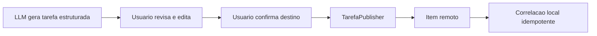

# SPEK-037 Mapeamento de tarefas externas

## Objetivo

Transformar tarefas estruturadas e evidenciadas da ata em candidatas revisaveis, permitindo publicar itens selecionados por adapters externos sem dar a LLM autoridade para escrever fora do Anamnesis.

## Fora de escopo

- Implementar Trello ou Azure DevOps.
- Publicar automaticamente ao concluir uma ata.
- Sincronizacao bidirecional de estado, comentarios ou responsaveis.
- Excluir, concluir, reabrir ou mover item remoto automaticamente.
- Tornar o sistema externo fonte de verdade da reuniao.

## Modelo local minimo

| Campo | Responsabilidade |
| --- | --- |
| `TarefaLocalId` | Identidade estavel persistida, independente da ordem na ata |
| `ReuniaoId` | Origem auditavel |
| `Descricao`, `Responsavel`, `Prazo` | Dados propostos e editaveis antes do envio |
| `Evidencia` | Referencia temporal exigida pela SPEK-002 |
| `Provider`, `ContaId`, `DestinoId` | Destino escolhido pelo usuario |
| `RemoteId`, `RemoteRevision` | Correlacao depois do envio |
| `PayloadHash` | Evita atualizacao sem mudanca |
| `StatusPublicacao` | Pendente, aprovada, enviando, publicada, resultado desconhecido ou falhou |

## Regras

- A tela apresenta o payload final exato depois da normalizacao do adapter e exige selecao explicita de tarefas, conta e destino.
- O usuario pode editar titulo, descricao, responsavel e prazo antes de confirmar; a ata arquivada nao e reescrita.
- `Responsavel` vindo da ata e apenas texto sugerido. Atribuir pessoa remota exige selecao explicita de uma identidade retornada pelo provider.
- Cada lote exige confirmacao que informa quais dados sairao da maquina.
- A LLM nao chama `TarefaPublisher`, nao escolhe conta e nao confirma publicacao.
- A unicidade `(Provider, ContaId, TarefaLocalId)` impede duplicacao local.
- Reprocessamento nunca recicla uma identidade ja publicada. Correspondencia entre tarefa antiga e nova exige confirmacao humana.
- Antes do POST, o job persiste estado `Enviando` e um identificador de tentativa.
- `RemoteId` e persistido antes de concluir o job de publicacao.
- Crash ou timeout depois do POST e antes de persistir `RemoteId` produz `ResultadoDesconhecido`.
- `ResultadoDesconhecido` nunca repete POST automaticamente. Primeiro reconcilia pelo marcador remoto; se o provider nao provar o resultado, exige decisao humana.
- `PayloadHash` evita updates sem mudanca; revisao remota evita sobrescrever edicao concorrente quando o provider suportar.
- O primeiro corte cria e atualiza somente campos de propriedade do Anamnesis.
- Falha externa permite retentativa manual e nao altera reuniao, ata, arquivamento ou retencao.
- Credenciais pertencem ao adapter e usam armazenamento protegido, nunca o modelo de tarefa.
- O journal registra provider, resultado e identificadores tecnicos, sem corpo integral da tarefa ou token.

## Fluxo de autoridade

## Critérios de aceite

- [ ] Somente tarefa com identidade e evidencia estaveis pode entrar no preview.
- [ ] Nenhuma publicacao ocorre sem confirmacao humana do lote e do destino.
- [ ] Cancelar o preview nao cria job nem chama adapter.
- [ ] Preview corresponde byte a byte aos campos normalizados enviados depois da confirmacao.
- [ ] Nome livre da LLM nunca e convertido automaticamente em identidade remota.
- [ ] Repetir uma solicitacao concluida retorna o mesmo `RemoteId`.
- [ ] Timeout depois de criacao nao produz duplicata na reconciliacao testada.
- [ ] Crash entre POST e persistencia de `RemoteId` termina em `ResultadoDesconhecido` e nao dispara novo POST automatico.
- [ ] Atualizacao concorrente e detectada quando o provider oferecer revisao.
- [ ] Falha de provider e recuperavel e isolada do ciclo da reuniao.
- [ ] Nenhuma operacao automatica exclui, conclui ou fecha item remoto.
- [ ] Testes de Application usam publisher fake, relogio controlado e banco temporario.
- [ ] Teste arquitetural prova que publisher e adapters nao recebem interface de retencao nem caminho da gravacao.

## Dependencias

- A parte de evidencias temporais por tarefa da SPEK-002 deve estar concluida antes da publicacao externa.
- O Desktop real da SPEK-030 fornece preview, configuracao e historico de publicacoes.
- Um ADR aceito define aprovacao, idempotencia, dados sensiveis e propriedade de campos remotos.

## Decisoes pendentes

- Definir se a edicao pre-envio gera uma revisao local separada da tarefa original da ata.
- Definir retencao do historico de publicacao sem guardar conteudo remoto desnecessario.
